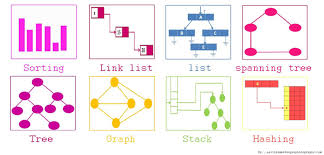
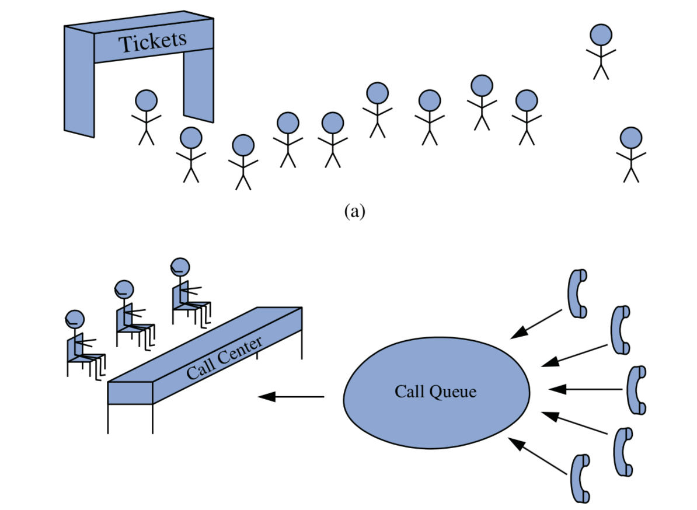

# Stacks & Queues

Universidad Panamericana Campus Bonaterra  
November 2018  
Instructor: Luis E. Correa Morán  

## Contents

* [Motivation](#Motivation)  
* [Introduction to Data Structures](#Data-Structures)  
* [Stacks](#Stacks)  
* [Queues](#Queues)  


## Motivation

Stacks and Queues, even though they represent the most basic data structures, they are part of the most common day-to-day tasks.

If you ever compiled and run a program, the memory is managed in a stack. Queues help your CPU and Disc to prioritize tasks in your favorite OS.

Even further, they represent key elements of more useful and complex algorithms, such as BFS (queues) and DFS (stack).


## Data Structures
 

> **A data structure is a particular way of organizing data in a computer so that it can be used efficiently.** Data structures can implement one or more particular abstract data types(ADT), which are the means of specifying the contract of operations and their complexity.  

 

*Another definition...*
> In computer science, a data structure is a **data organization, management and storage format** that **enables efficient access and modification**. More precisely, a data structure is a **collection of data values, the relationships among them, and the functions or operations that can be applied to the data**.  


**Object Oriented Programming is crucial, for developing your own!**


[Goodrich, M. Data Structures & Algorithms 6th Edition (Amazon Link)](https://www.amazon.com/Data-Structures-Algorithms-Michael-Goodrich/dp/1118771338/ref=sr_1_2?s=books&ie=UTF8&qid=1543038278&sr=1-2&keywords=data+structures+goodrich)

> Question: How is a Data Structure different or similar to an Algorithm?

## Stacks


A stack is a **collection of objects** that are inserted and removed according to the last-in, first-out **(LIFO)** principle. **A user may insert objects into a stack at any time, but may only access or remove the most recently inserted object that remains (at the so-called “top” of the stack).**


### C++ Implementation

[Docs for stack implementation](http://www.cplusplus.com/reference/stack/stack/)

#### Functions
| constructor | Construct stack (public member function ) |
|-------------|-----------------------------------------------------------|
| empty | Test whether container is empty (public member function ) |
| size | Return size (public member function ) |
| top | Access next element (public member function ) |
| push | Insert element (public member function ) |
| emplace | Construct and insert element (public member function ) |
| pop | Remove top element (public member function ) |
| swap | Swap contents (public member function ) |

#### Example
```c++
// stack::push/pop
#include <iostream>       // std::cout
#include <stack>          // std::stack

int main ()
{
  std::stack<int> mystack;

  for (int i=0; i<5; ++i) mystack.push(i);

  std::cout << "Popping out elements...";
  while (!mystack.empty())
  {
     std::cout << ' ' << mystack.top();
     mystack.pop();
  }
  std::cout << '\n';

  return 0;
}
```
### Quick Implementation in C++

[stack.cpp](code/stack.cpp)

### Appearance


### Exercise

> **1. Flip an array using a stack.**  


> **2. Design a stack that supports getMin() in O(1) time and O(1) extra space**  
> Design a Data Structure SpecialStack that supports all the stack operations like push(), pop(), isEmpty(), isFull() and an additional operation getMin() which should return minimum element from the SpecialStack. All these operations of SpecialStack must be O(1). To implement SpecialStack, you should only use standard Stack data structure and no other data structure like arrays, list, .. etc.

## Queues



Another fundamental data structure is the queue. It is a close “cousin” of the stack, but a queue is a **collection of objects** that are inserted and removed according to the **first-in, first-out (FIFO) principle**. That is, **elements can be inserted at any time, but only the element that has been in the queue the longest can be next removed**.


### C++ Implementation

[Docs for queue implementation](http://www.cplusplus.com/reference/queue/queue/)

#### Functions
| constructor | Construct stack (public member function ) |
|-------------|-----------------------------------------------------------|
| empty | Test whether container is empty (public member function ) |
| size | Return size (public member function ) |
| front | Access next element (public member function ) |
| back | Access last element (public member function ) |
| push | Insert element (public member function ) |
| emplace | Construct and insert element (public member function ) |
| pop | Remove top element (public member function ) |
| swap | Swap contents (public member function ) |

#### Example

```c++
// queue::push/pop
#include <iostream>       // std::cin, std::cout
#include <queue>          // std::queue

int main ()
{
  std::queue<int> myqueue;
  int myint;

  std::cout << "Please enter some integers (enter 0 to end):\n";

  do {
    std::cin >> myint;
    myqueue.push (myint);
  } while (myint);

  std::cout << "myqueue contains: ";
  while (!myqueue.empty())
  {
    std::cout << ' ' << myqueue.front();
    myqueue.pop();
  }
  std::cout << '\n';

  return 0;
}
```

### Exercise

[Problem **Code Monk**](https://www.hackerearth.com/challenge/competitive/code-monk-stacks-queues/algorithm/monks-love-for-food/)